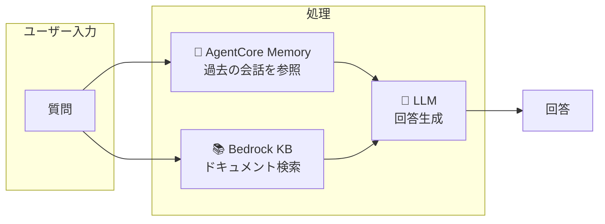
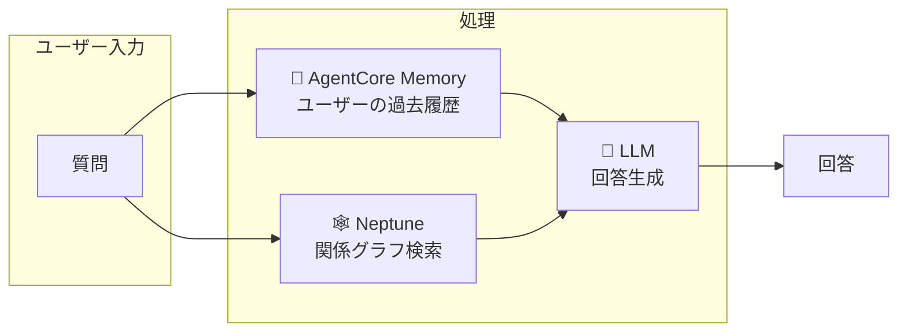
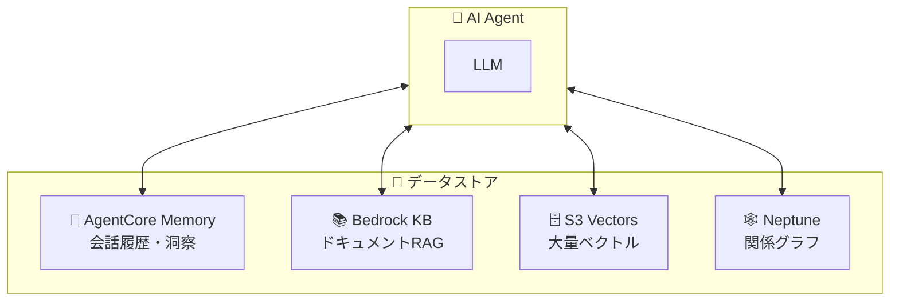
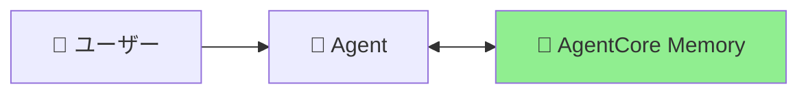
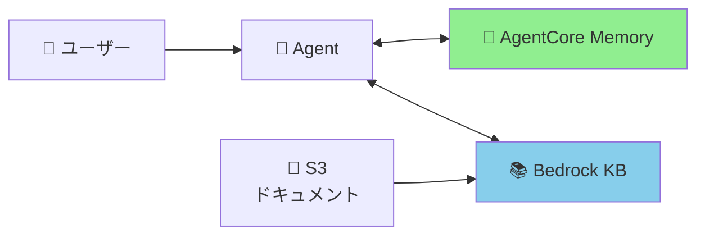
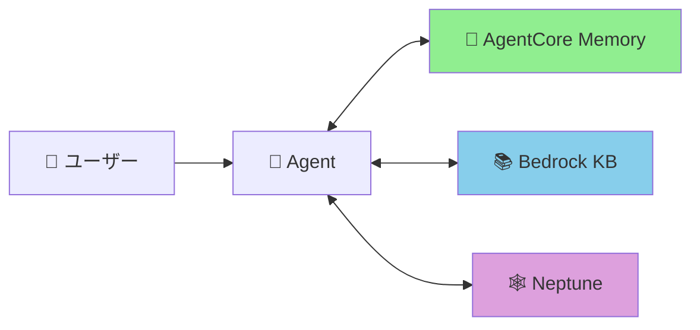

# 🧠 Amazon Bedrock AgentCore のメモリ設計完全ガイド

> **「エピソード記憶ってどこに保存すればいいの？」を解決する**

## 📖 はじめに

AgentCoreを使ったAIエージェント開発で、こんな疑問を持ったことはありませんか？

- 「エピソード記憶ってBedrock Knowledge Baseに入れるべき？」
- 「S3 VectorsとBedrock KBの違いがわからない...」
- 「結局どのストアに何を保存すればいいの？」

この記事では、**AgentCore Memory / Bedrock KB / S3 Vectors / Neptune の役割分担**を明確にし、迷わない設計指針を提供します。

:::message
**✅ 検証完了**: 本記事のAPIはすべて boto3 で利用可能です（2024年12月時点）。

検証済みAPI:
- `boto3.client("bedrock-agentcore-control")` - AgentCore Memory コントロールプレーン
- `boto3.client("bedrock-agentcore")` - AgentCore Memory データプレーン
- `boto3.client("s3vectors")` - S3 Vectors
- `boto3.client("bedrock-agent")` - Bedrock Knowledge Base 操作
- `boto3.client("bedrock-agent-runtime")` - Retrieve/RetrieveAndGenerate
:::

---

## 🎯 結論から言うと

**エピソード記憶は AgentCore Memory だけでOK！**

| ストア | 何を入れる？ | エピソード記憶 |
|--------|------------|---------------|
| 🧠 AgentCore Memory | 会話履歴・エピソード・洞察 | ✅ **ここに入れる** |
| 📚 Bedrock KB | ドキュメントRAG（マネージド） | ❌ 用途が違う |
| 🗄️ S3 Vectors | カスタムベクトル操作（低コスト） | ❌ 用途が違う |
| 🕸️ Neptune | エンティティ関係グラフ | ❌ 用途が違う |

### 📋 ユースケース早見表

| ユースケース | 最適なストア | 理由 |
|-------------|-------------|------|
| 「前回何を話したか覚えていてほしい」 | 🧠 AgentCore Memory | 会話履歴・コンテキスト保持 |
| 「ユーザーの傾向を把握したい」 | 🧠 AgentCore Memory | 長期的な洞察の自動抽出 |
| 「PDFマニュアルを検索できるようにしたい」 | 📚 Bedrock KB | ドキュメント自動取り込み・RAG |
| 「動画・音声ファイルも検索したい」 | 📚 Bedrock KB | マルチモーダル対応 |
| 「100万件のベクトルを安く保存したい」 | 🗄️ S3 Vectors | コスト最大90%削減 |
| 「独自のエンベディングモデルを使いたい」 | 🗄️ S3 Vectors | エンベディング生成をカスタマイズ |
| 「エンティティ間の関係を表現したい」 | 🕸️ Neptune | グラフ構造で関係性を表現 |
| 「最短経路を計算したい」 | 🕸️ Neptune | グラフ最短経路アルゴリズム |

---

## 🧠 AgentCore Memory を深掘り

AgentCore Memoryは**4種類のメモリタイプ**を提供するマネージドサービスです。

### 🎯 ユースケース事例

| シナリオ | 活用方法 |
|---------|---------|
| **カスタマーサポートAI** | 「前回の問い合わせ内容は何でしたか？」→ 過去セッションを検索して回答 |
| **パーソナルアシスタント** | 「私の好みを覚えておいて」→ 長期的な好みを自動抽出 |
| **営業アシスタントAI** | 「この顧客との商談履歴は？」→ 過去の会話を要約して提示 |
| **ヘルスケアAI** | 「この患者の症状の傾向は？」→ 長期的なパターンを分析 |

### メモリタイプ一覧

| タイプ | boto3 API | 用途 | 例 |
|--------|-----------|------|-----|
| **Short-term** | `create_event()` | セッション中のコンテキスト | 現在の会話履歴 |
| **Episodic** | `summaryMemoryStrategy` | 会話の要約 | 「1/15に評価で85点取った」 |
| **Semantic** | `semanticMemoryStrategy` | 学習した事実・知識 | 「このユーザーはPythonが得意」 |
| **Reflections** | `userPreferenceMemoryStrategy` | ユーザーの好み・傾向 | 「朝の作業効率が高い傾向」 |

:::message
**API構成**: Short-term は `create_event()` で直接保存。Long-term（Episodic/Semantic/Reflections）は `memoryStrategies` で設定すると**自動抽出**される。
:::

### 💡 実装例（boto3 API）

```python
import boto3
from datetime import datetime

# クライアント初期化（2つのクライアントが必要）
control_client = boto3.client("bedrock-agentcore-control", region_name="us-east-1")
data_client = boto3.client("bedrock-agentcore", region_name="us-east-1")

# Memory リソース作成（Long-term Strategies付き）
memory_response = control_client.create_memory(
    name="my-agent-memory",
    description="Memory with long-term extraction",
    eventExpiryDuration=90,  # 90日間保持
    memoryStrategies=[
        # Summary Strategy → Episodic Memory
        {
            "summaryMemoryStrategy": {
                "name": "SessionSummarizer",
                "namespaces": ["/summaries/{actorId}/{sessionId}"]
            }
        },
        # User Preference Strategy → Reflections
        {
            "userPreferenceMemoryStrategy": {
                "name": "PreferenceLearner",
                "namespaces": ["/preferences/{actorId}"]
            }
        },
        # Semantic Strategy → Semantic Memory
        {
            "semanticMemoryStrategy": {
                "name": "FactExtractor",
                "namespaces": ["/facts/{actorId}"]
            }
        }
    ]
)
memory_id = memory_response["memory"]["id"]

# Short-term Memory（会話イベントを保存）
actor_id = "user_123"
session_id = "session_abc123"

event = data_client.create_event(
    memoryId=memory_id,
    actorId=actor_id,
    sessionId=session_id,
    eventTimestamp=datetime.now(),
    payload=[
        {
            "conversational": {
                "content": {"text": "商品Aについて教えてください"},
                "role": "USER"
            }
        },
        {
            "conversational": {
                "content": {"text": "商品Aは〇〇の特徴があります。"},
                "role": "ASSISTANT"
            }
        }
    ]
)

# Long-term Memory 検索（セマンティック検索）
# ※ Long-term 抽出は非同期で自動実行される
records = data_client.retrieve_memory_records(
    memoryId=memory_id,
    actorId=actor_id,
    query="過去の問い合わせ内容",  # 自然言語クエリ
    maxResults=5
)
```

:::message
**ポイント**: `actorId` を指定することで、ユーザーごとにメモリが自動分離されます。マルチテナント対応もこれだけでOK！
:::

---

## 📚 Bedrock Knowledge Bases の役割

**フルマネージドRAGサービス**。S3にファイルを配置するだけで、チャンキング・エンベディング生成・ベクトル格納が自動で行われます。

:::message alert
**重要**: Bedrock KB と S3 Vectors は**別のサービス**です。

- **Bedrock KB**: マネージドRAG（自動でエンベディング生成・チャンキング）
- **S3 Vectors**: ベクトルストレージ（自分でエンベディング生成が必要）
:::

### 🎯 ユースケース事例

| シナリオ | 活用方法 |
|---------|---------|
| **社内FAQチャットボット** | 社内規定PDFを取り込み → 「有給休暇の申請方法は？」に回答 |
| **製品マニュアル検索** | 取扱説明書を取り込み → 「エラーコードE-102の対処法は？」 |
| **動画コンテンツ検索** | 研修動画を取り込み → 「セキュリティ研修の該当箇所は？」（タイムスタンプ付き） |
| **技術ドキュメントQ&A** | API仕様書を検索 → 「認証エンドポイントの使い方は？」 |

### 📁 対応ファイル形式（自動取り込み対象）

| カテゴリ | 対応形式 |
|---------|---------|
| **テキスト** | `.txt`, `.md`, `.html`, `.doc`, `.docx`, `.pdf` |
| **スプレッドシート** | `.xls`, `.xlsx`, `.csv` |
| **画像** | `.png`, `.jpg`, `.jpeg`, `.gif`, `.webp` |
| **音声** | `.mp3`, `.ogg`, `.wav`, `.flac`, `.m4a` |
| **動画** | `.mp4`, `.mov`, `.mkv`, `.webm`, `.mpeg` |

:::message
**マルチモーダル対応**: 2024年末にマルチモーダル検索がGA。テキスト・画像・音声・動画を統合検索可能。音声は自動文字起こし、動画はタイムスタンプ付きで検索結果を返却。
:::

### ✅ 入れるべきもの
- 社内ドキュメント（規定、マニュアル）
- 技術ドキュメント（API仕様書、設計書）
- 研修動画・音声ファイル
- 製品カタログ

### ❌ 入れるべきでないもの
- ユーザーのエピソード記憶（→ AgentCore Memory）
- 会話履歴（→ AgentCore Memory）

### 💡 実装例（boto3 API）

```python
import boto3

# Bedrock Agent クライアント
bedrock_agent = boto3.client("bedrock-agent", region_name="us-west-2")
bedrock_runtime = boto3.client("bedrock-agent-runtime", region_name="us-west-2")

# 1. Knowledge Base 作成
kb_response = bedrock_agent.create_knowledge_base(
    name="my-knowledge-base",
    roleArn="arn:aws:iam::123456789012:role/BedrockKBRole",
    knowledgeBaseConfiguration={
        "type": "VECTOR",
        "vectorKnowledgeBaseConfiguration": {
            "embeddingModelArn": "arn:aws:bedrock:us-west-2::foundation-model/amazon.titan-embed-text-v2:0"
        }
    },
    storageConfiguration={
        "type": "S3_VECTOR"  # または OPENSEARCH_SERVERLESS
    }
)
kb_id = kb_response["knowledgeBase"]["knowledgeBaseId"]

# 2. Data Source 作成（S3バケットを指定）
ds_response = bedrock_agent.create_data_source(
    knowledgeBaseId=kb_id,
    name="my-documents",
    dataSourceConfiguration={
        "type": "S3",
        "s3Configuration": {
            "bucketArn": "arn:aws:s3:::my-document-bucket"
        }
    }
)

# 3. Ingestion Job 開始（S3から自動取り込み）
bedrock_agent.start_ingestion_job(
    knowledgeBaseId=kb_id,
    dataSourceId=ds_response["dataSource"]["dataSourceId"]
)

# 4. 検索（Retrieve API）
response = bedrock_runtime.retrieve(
    knowledgeBaseId=kb_id,
    retrievalQuery={"text": "有給休暇の申請方法は？"},
    retrievalConfiguration={
        "vectorSearchConfiguration": {
            "numberOfResults": 5
        }
    }
)

# 5. RAG（RetrieveAndGenerate API）
rag_response = bedrock_runtime.retrieve_and_generate(
    input={"text": "有給休暇の申請方法を教えてください"},
    retrieveAndGenerateConfiguration={
        "type": "KNOWLEDGE_BASE",
        "knowledgeBaseConfiguration": {
            "knowledgeBaseId": kb_id,
            "modelArn": "arn:aws:bedrock:us-west-2::foundation-model/anthropic.claude-3-sonnet-20240229-v1:0"
        }
    }
)
print(rag_response["output"]["text"])
```

---

## 🗄️ S3 Vectors の役割（低レベルAPI）

**コスト最適化されたベクトルストレージ**。エンベディング生成は自分で行う必要がありますが、ストレージコストを最大90%削減できます。

### S3 Vectors の特徴

| 項目 | 詳細 |
|------|------|
| **スケール** | 1インデックスあたり最大20億ベクトル、1バケットあたり最大10,000インデックス |
| **レイテンシ** | 低頻度クエリ: サブ秒、高頻度クエリ: 約100ms |
| **コスト削減** | 従来のベクトルDBと比較して最大90%削減 |
| **暗号化** | SSE-S3 または SSE-KMS（カスタマーマネージドキー） |
| **リージョン** | us-east-1, us-east-2, us-west-2, eu-central-1, ap-southeast-2 など14リージョン |

### 🎯 ユースケース事例

| シナリオ | 活用方法 |
|---------|---------|
| **ECサイトの商品検索** | 100万商品のベクトルを低コストで保存・類似商品検索 |
| **画像類似検索** | 画像のベクトルを保存し、類似画像を検索 |
| **アーカイブ検索** | 過去10年分の記事を月1回のバッチでインデックス |
| **独自モデル活用** | 社内で訓練したエンベディングモデルを使用 |

### Bedrock KB との違い

| 観点 | Bedrock KB | S3 Vectors |
|------|-----------|------------|
| **エンベディング生成** | ✅ 自動 | ❌ 手動（Bedrock Invoke等） |
| **チャンキング** | ✅ 自動 | ❌ 手動 |
| **データ取り込み** | ✅ S3同期（Ingestion Job） | ❌ PutVectors API |
| **RAG統合** | ✅ RetrieveAndGenerate | ❌ 別途実装が必要 |
| **マルチモーダル** | ✅ 画像・音声・動画対応 | ❌ ベクトルのみ |
| **コスト** | 💰💰 中程度 | 💰 最低 |
| **開発工数** | 低 | 高 |
| **柔軟性** | 中 | 高 |

:::message
**使い分け**: 
- **Bedrock KB**: 「S3にファイルを置くだけでRAGしたい」→ マネージドで楽
- **S3 Vectors**: 「コスト最優先」「独自エンベディング」「大量ベクトル」→ 低レベル制御
:::

### 💡 実装例（boto3 API）

```python
import boto3
import json

# S3 Vectors クライアント
s3vectors = boto3.client("s3vectors", region_name="us-west-2")
bedrock_runtime = boto3.client("bedrock-runtime", region_name="us-west-2")

# 1. Vector Bucket 作成
s3vectors.create_vector_bucket(
    vectorBucketName="my-vector-bucket"
)

# 2. Vector Index 作成
s3vectors.create_index(
    vectorBucketName="my-vector-bucket",
    indexName="product-catalog",
    dimension=1024,  # Titan Embed v2 の次元数
    distanceMetric="cosine"
)

# 3. エンベディング生成（手動）
response = bedrock_runtime.invoke_model(
    modelId="amazon.titan-embed-text-v2:0",
    body=json.dumps({"inputText": "赤いスニーカー メンズ"})
)
embedding = json.loads(response["body"].read())["embedding"]

# 4. ベクトル挿入
s3vectors.put_vectors(
    vectorBucketName="my-vector-bucket",
    indexName="product-catalog",
    vectors=[{
        "key": "product-001",
        "data": {"float32": embedding},
        "metadata": {"category": "shoes", "color": "red", "price": 12000}
    }]
)

# 5. ベクトル検索
query_response = bedrock_runtime.invoke_model(
    modelId="amazon.titan-embed-text-v2:0",
    body=json.dumps({"inputText": "赤い靴を探しています"})
)
query_embedding = json.loads(query_response["body"].read())["embedding"]

results = s3vectors.query_vectors(
    vectorBucketName="my-vector-bucket",
    indexName="product-catalog",
    queryVector={"float32": query_embedding},
    topK=10,
    filter={"category": "shoes"},  # メタデータフィルタ
    returnMetadata=True
)

for vec in results["vectors"]:
    print(f"Key: {vec['key']}, Distance: {vec['distance']:.4f}")
```

---

## 🕸️ Neptune（Knowledge Graph）の役割

Neptuneは**エンティティ間の関係性をグラフ構造で表現**するためのサービスです。

### 🎯 ユースケース事例

| シナリオ | 活用方法 |
|---------|---------|
| **スキルマップ** | 「Pythonを学ぶには何が前提？」→ グラフで依存関係を表示 |
| **推薦システム** | 「この商品を買った人はこれも買っています」→ グラフベースの推薦 |
| **組織図** | 「この人の上司は誰？」→ 階層構造をトラバース |
| **ナレッジグラフ** | 「この概念と関連するトピックは？」→ 隣接ノードを探索 |
| **不正検知** | 金融取引のパターン分析 → サイクル検出で異常を発見 |

### ✅ 入れるべきもの

- エンティティ間の関係（前提条件、依存関係）
- 階層構造（組織図、カテゴリ）
- ネットワーク構造（ソーシャルグラフ、取引ネットワーク）

### 💡 実装例（boto3 + Gremlin）

```python
import boto3
from gremlin_python.driver import client, serializer

# Neptune クライアント作成
neptune = boto3.client("neptune", region_name="us-west-2")

# Gremlin クライアント（グラフクエリ用）
gremlin_client = client.Client(
    "wss://your-neptune-endpoint:8182/gremlin",
    "g",
    message_serializer=serializer.GraphSONSerializersV2d0()
)

# 頂点を作成（例: スキル）
gremlin_client.submit("""
    g.addV('skill').property('name', 'Python').property('level', 'beginner')
""")

gremlin_client.submit("""
    g.addV('skill').property('name', 'Machine Learning').property('level', 'advanced')
""")

# 辺を作成（前提関係）
gremlin_client.submit("""
    g.V().has('name', 'Python')
     .addE('prerequisite_of')
     .to(g.V().has('name', 'Machine Learning'))
""")

# 最短パスを検索
result = gremlin_client.submit("""
    g.V().has('name', 'Python')
     .repeat(out('prerequisite_of').simplePath())
     .until(has('name', 'Machine Learning'))
     .path()
     .by('name')
     .limit(1)
""")

for path in result:
    print(f"Learning path: {' -> '.join(path)}")
```

---

## 🔄 複数ストアの連携パターン

基本は AgentCore Memory だけでOKですが、以下のケースでは連携を検討します。

### パターン1: AgentCore Memory + Bedrock KB

**ユースケース**: 会話履歴を保持しつつ、ドキュメントも検索したい



### パターン2: AgentCore Memory + Neptune

**ユースケース**: 会話履歴を保持しつつ、エンティティ関係も参照したい



### パターン3: 全部組み合わせ

**ユースケース**: フル機能のエンタープライズAIエージェント



---

## 📊 段階的な導入アプローチ

### Phase 1: MVP（最小構成）



**構成**: AgentCore Memory のみ
**できること**: 会話履歴保持、ユーザー傾向の学習

### Phase 2: ドキュメント検索追加



**追加**: Bedrock KB
**できること**: + 社内ドキュメント検索、FAQ回答

### Phase 3: グラフ構造追加



**追加**: Neptune
**できること**: + 関係性の可視化、パス計算

---

## 📝 まとめ

### ドキュメントRAG vs カスタムベクトルの違い

| 観点 | ドキュメントRAG（Bedrock KB） | カスタムベクトル（S3 Vectors） |
|------|----------------------------|------------------------------|
| **入力** | ファイル（PDF、Word、動画など） | ベクトル（数値配列） |
| **処理** | 自動（チャンキング→エンベディング→格納） | 手動（自分でエンベディング生成） |
| **出力** | テキスト断片 + LLM回答 | 類似ベクトルのキーとメタデータ |
| **適したケース** | 非構造化ドキュメントの検索 | 大量データの類似検索 |

### メモリ設計の鉄則

| 保存したいもの | 最適なストア | 理由 |
|--------------|-------------|------|
| 会話履歴・体験記録 | 🧠 AgentCore Memory | ユーザー単位の自動分離、洞察抽出 |
| PDF・Word・動画などのファイル | 📚 Bedrock KB | 自動取り込み、マルチモーダル対応 |
| 大量のベクトルデータ | 🗄️ S3 Vectors | コスト90%削減、20億ベクトル対応 |
| エンティティ間の関係 | 🕸️ Neptune | グラフ構造、パス計算 |

:::message
**迷ったら**:
1. 「ユーザーの体験を覚えたい」→ **AgentCore Memory**
2. 「ファイルを検索したい」→ **Bedrock KB**
3. 「ベクトルを安く保存したい」→ **S3 Vectors**
4. 「関係性を表現したい」→ **Neptune**
:::

---

## 📚 参考リンク

- [Amazon Bedrock AgentCore Memory](https://docs.aws.amazon.com/bedrock-agentcore/latest/devguide/memory.html)
- [Amazon Bedrock Knowledge Bases](https://docs.aws.amazon.com/bedrock/latest/userguide/knowledge-base.html)
- [Amazon S3 Vectors](https://docs.aws.amazon.com/AmazonS3/latest/userguide/s3-vectors.html)
- [Amazon Neptune](https://docs.aws.amazon.com/neptune/latest/userguide/intro.html)

---

**🙏 この記事が参考になったら、いいねをお願いします！**
