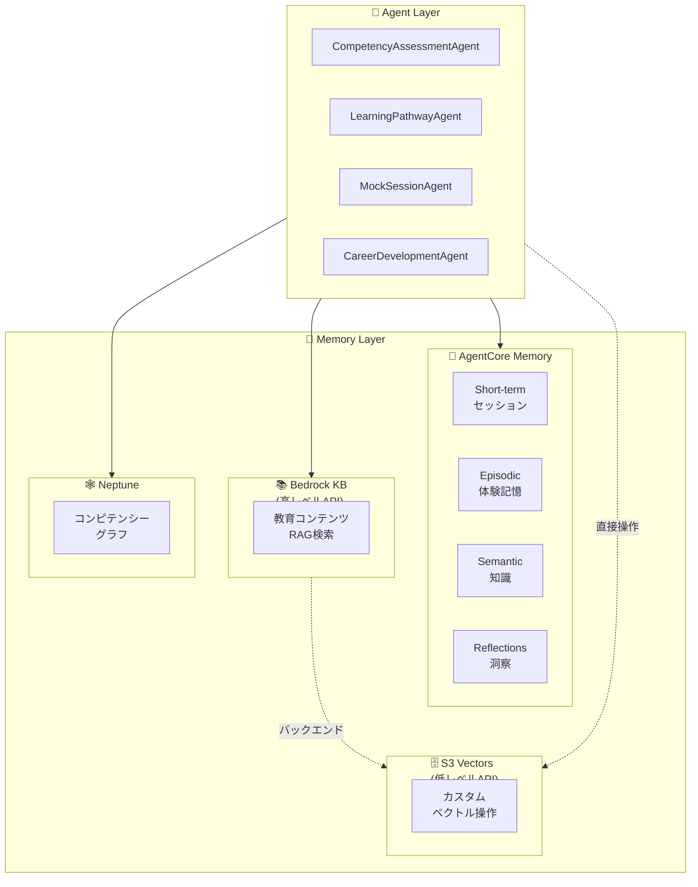
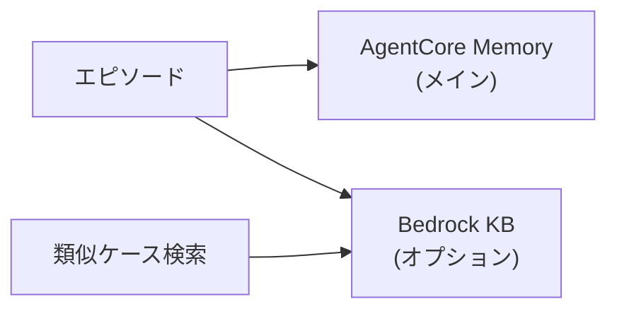
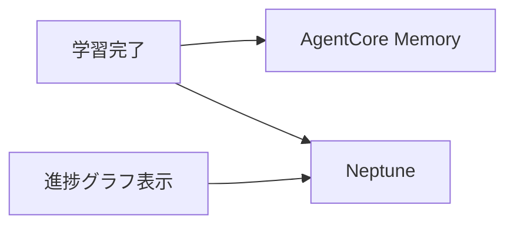

# 🧠 Amazon Bedrock AgentCore のメモリ設計完全ガイド

> **「エピソード記憶ってどこに保存すればいいの？」を解決する**

## 📖 はじめに

AgentCoreを使ったAIエージェント開発で、こんな疑問を持ったことはありませんか？

- 「エピソード記憶ってBedrock Knowledge Baseに入れるべき？」
- 「Neptuneとの使い分けがわからない...」
- 「結局どのストアに何を保存すればいいの？」

この記事では、**AgentCore Memory / Bedrock KB / Neptune の役割分担**を明確にし、迷わない設計指針を提供します。

:::message
この記事は「Learning Achievement Coach」（学習到達度コーチ）システムの設計ドキュメントです。
:::

:::message
**✅ 検証完了**: AgentCore Memory SDK は boto3 で利用可能です（2024年12月時点）。

検証済みAPI情報（検証環境: boto3 1.42.16, botocore 1.42.16, Python 3.14）:
- ✅ `boto3.client("s3vectors")` - S3 Vectors クライアント → [01_s3_vectors_direct.py](src/01_s3_vectors_direct.py)
- ✅ `boto3.client("bedrock-agent")` - Bedrock Knowledge Base 操作 → [02_bedrock_kb_with_s3vectors.py](src/02_bedrock_kb_with_s3vectors.py)
- ✅ `boto3.client("bedrock-agent-runtime")` - Retrieve/RetrieveAndGenerate → [02_bedrock_kb_with_s3vectors.py](src/02_bedrock_kb_with_s3vectors.py)
- ✅ `boto3.client("bedrock-agentcore-control")` - AgentCore Memory コントロールプレーン → [05_agentcore_memory.py](src/05_agentcore_memory.py)
- ✅ `boto3.client("bedrock-agentcore")` - AgentCore Memory データプレーン → [05_agentcore_memory.py](src/05_agentcore_memory.py)

**📝 検証用サンプルコード**: [src/](src/) ディレクトリを参照
:::

---

## 🎯 結論から言うと

**エピソード記憶は AgentCore Memory だけでOK！**

| ストア | 何を入れる？ | エピソード記憶 | サンプル |
|--------|------------|---------------|---------|
| 🧠 AgentCore Memory | 会話履歴・エピソード・洞察 | ✅ **ここに入れる** | [05_agentcore_memory.py](src/05_agentcore_memory.py) |
| 📚 Bedrock KB | ドキュメントRAG（マネージド） | ❌ 用途が違う | [02](src/02_bedrock_kb_with_s3vectors.py), [03](src/03_bedrock_kb_with_opensearch.py) |
| 🗄️ S3 Vectors | カスタムベクトル操作（低コスト） | ❌ 用途が違う | [01_s3_vectors_direct.py](src/01_s3_vectors_direct.py) |
| 🕸️ Neptune | コンピテンシー関係グラフ | ❌ 用途が違う | - |

### 📋 ユースケース早見表

| ユースケース | 最適なストア | 理由 |
|-------------|-------------|------|
| 「前回何を話したか覚えていてほしい」 | 🧠 AgentCore Memory | 会話履歴・コンテキスト保持 |
| 「ユーザーの学習傾向を把握したい」 | 🧠 AgentCore Memory | 長期的な洞察の自動抽出 |
| 「PDFマニュアルを検索できるようにしたい」 | 📚 Bedrock KB | ドキュメント自動取り込み・RAG |
| 「社内FAQをチャットボットで回答したい」 | 📚 Bedrock KB | RetrieveAndGenerate で回答生成 |
| 「100万件のベクトルを安く保存したい」 | 🗄️ S3 Vectors | コスト最大90%削減 |
| 「独自のエンベディングモデルを使いたい」 | 🗄️ S3 Vectors | エンベディング生成をカスタマイズ |
| 「スキル間の前提関係を表現したい」 | 🕸️ Neptune | グラフ構造で関係性を表現 |
| 「最短の学習パスを計算したい」 | 🕸️ Neptune | グラフ最短経路アルゴリズム |

---

## 🏗️ 全体アーキテクチャ

まず全体像を把握しましょう。



---

## 🧠 AgentCore Memory を深掘り

AgentCore Memoryは**4種類のメモリタイプ**を提供するマネージドサービスです。

### 🎯 ユースケース事例

| シナリオ | 活用方法 |
|---------|---------|
| **カスタマーサポートAI** | 「前回の問い合わせ内容は何でしたか？」→ 過去セッションを検索して回答 |
| **学習コーチAI** | 「この生徒の苦手分野は？」→ 過去の評価結果から洞察を自動抽出 |
| **営業アシスタントAI** | 「この顧客との商談履歴は？」→ 過去の会話を要約して提示 |
| **ヘルスケアAI** | 「この患者の症状の傾向は？」→ 長期的なパターンを分析 |

### メモリタイプ一覧

| タイプ | boto3 API | 用途 | 例 |
|--------|-----------|------|-----|
| **Short-term** | `create_event()` | セッション中のコンテキスト | 現在の会話履歴 |
| **Episodic** | `summaryMemoryStrategy` | 会話の要約 | 「1/15にPython評価で85点取った」 |
| **Semantic** | `semanticMemoryStrategy` | 学習した事実・知識 | 「このユーザーはPythonが得意」 |
| **Reflections** | `userPreferenceMemoryStrategy` | ユーザーの好み・傾向 | 「朝の学習効率が高い傾向」 |

:::message
**API構成**: Short-term は `create_event()` で直接保存。Long-term（Episodic/Semantic/Reflections）は `memoryStrategies` で設定すると**自動抽出**される。
:::

### 💡 実装例（boto3 API）

```python
import boto3
from datetime import datetime

# ━━━━━━━━━━━━━━━━━━━━━━━━━━━━━━━━━━━━━━━━
# 🔹 クライアント初期化（2つのクライアントが必要）
# ━━━━━━━━━━━━━━━━━━━━━━━━━━━━━━━━━━━━━━━━
control_client = boto3.client("bedrock-agentcore-control", region_name="us-east-1")
data_client = boto3.client("bedrock-agentcore", region_name="us-east-1")

# ━━━━━━━━━━━━━━━━━━━━━━━━━━━━━━━━━━━━━━━━
# 🔹 Memory リソース作成（Long-term Strategies付き）
# ━━━━━━━━━━━━━━━━━━━━━━━━━━━━━━━━━━━━━━━━
memory_response = control_client.create_memory(
    name="learning-coach-memory",
    description="Learning Coach - Memory with long-term extraction",
    eventExpiryDuration=90,  # 90日間保持
    memoryStrategies=[
        # 📝 Summary Strategy → Episodic Memory 相当
        {
            "summaryMemoryStrategy": {
                "name": "SessionSummarizer",
                "namespaces": ["/summaries/{actorId}/{sessionId}"]
            }
        },
        # 💡 User Preference Strategy → Reflections 相当
        {
            "userPreferenceMemoryStrategy": {
                "name": "PreferenceLearner",
                "namespaces": ["/preferences/{actorId}"]
            }
        },
        # 🧠 Semantic Strategy → Semantic Memory 相当
        {
            "semanticMemoryStrategy": {
                "name": "FactExtractor",
                "namespaces": ["/facts/{actorId}"]
            }
        }
    ]
)
memory_id = memory_response["memory"]["id"]

# ━━━━━━━━━━━━━━━━━━━━━━━━━━━━━━━━━━━━━━━━
# 🔹 Short-term Memory（会話イベントを保存）
# ━━━━━━━━━━━━━━━━━━━━━━━━━━━━━━━━━━━━━━━━
actor_id = "user_123"
session_id = "session_abc123"

event = data_client.create_event(
    memoryId=memory_id,
    actorId=actor_id,
    sessionId=session_id,
    eventTimestamp=datetime.now(),
    payload=[
        {
            "conversational": {
                "content": {"text": "Pythonのループ処理を学びたいです"},
                "role": "USER"
            }
        },
        {
            "conversational": {
                "content": {"text": "Pythonのループ処理ですね！for文から始めましょう。"},
                "role": "ASSISTANT"
            }
        }
    ]
)

# ━━━━━━━━━━━━━━━━━━━━━━━━━━━━━━━━━━━━━━━━
# 🔹 Long-term Memory 検索（セマンティック検索）
# ━━━━━━━━━━━━━━━━━━━━━━━━━━━━━━━━━━━━━━━━
# ※ Long-term 抽出は非同期で自動実行される
records = data_client.retrieve_memory_records(
    memoryId=memory_id,
    actorId=actor_id,
    query="Pythonの学習進捗",  # 自然言語クエリ
    maxResults=5
)
# → 過去のエピソード・好み・事実が検索される

# ━━━━━━━━━━━━━━━━━━━━━━━━━━━━━━━━━━━━━━━━
# 🔹 名前空間でメモリレコード一覧取得
# ━━━━━━━━━━━━━━━━━━━━━━━━━━━━━━━━━━━━━━━━
preferences = data_client.list_memory_records(
    memoryId=memory_id,
    namespace=f"/preferences/{actor_id}"
)
# → ["朝の学習効率が高い", "視覚的な教材を好む", ...]
```

:::message
**ポイント**: `actorId` を指定することで、ユーザーごとにメモリが自動分離されます。マルチテナント対応もこれだけでOK！
:::

---

## 📚 Bedrock Knowledge Bases の役割

:::message alert
**重要**: Bedrock KB と S3 Vectors は**別のサービス**です。混同しないでください。
:::

| サービス | 抽象度 | 用途 | サンプル |
|---------|-------|------|---------|
| **Bedrock KB** | 高レベル（マネージドRAG） | ドキュメントQ&A、自動取り込み | [02_bedrock_kb_with_s3vectors.py](src/02_bedrock_kb_with_s3vectors.py) |
| **S3 Vectors** | 低レベル（ストレージAPI） | カスタムベクトル操作、コスト最優先 | [01_s3_vectors_direct.py](src/01_s3_vectors_direct.py) |

### Bedrock Knowledge Bases（高レベルAPI）

**フルマネージドRAGサービス**。ドキュメント取り込み・チャンキング・エンベディング生成が自動。

#### 🎯 ユースケース事例

| シナリオ | 活用方法 |
|---------|---------|
| **社内FAQチャットボット** | 社内規定PDFを取り込み → 「有給休暇の申請方法は？」に回答 |
| **製品マニュアル検索** | 取扱説明書を取り込み → 「エラーコードE-102の対処法は？」 |
| **法務ドキュメント検索** | 契約書テンプレートを検索 → 「NDAのひな形はある？」 |
| **技術ドキュメントQ&A** | API仕様書を検索 → 「認証エンドポイントの使い方は？」 |

#### ✅ 入れるべきもの
- 教育コンテンツ（チュートリアル、教材）
- リファレンスドキュメント
- 学習リソース情報

#### ❌ 入れるべきでないもの
- ユーザーのエピソード記憶（→ AgentCore Memory）
- 会話履歴（→ AgentCore Memory）

#### 💡 実装例（boto3 API）

```python
import boto3

# Bedrock Agent Runtime クライアント
bedrock_runtime = boto3.client("bedrock-agent-runtime", region_name="us-west-2")

# 教育コンテンツを検索（Retrieve API）
response = bedrock_runtime.retrieve(
    knowledgeBaseId="KB_EDUCATION_CONTENT",
    retrievalQuery={"text": "Python 初心者向け リスト操作 チュートリアル"},
    retrievalConfiguration={
        "vectorSearchConfiguration": {
            "numberOfResults": 5,
            "filter": {
                "andAll": [
                    {"equals": {"key": "competency_id", "value": "python_basics"}},
                    {"equals": {"key": "level", "value": "beginner"}}
                ]
            }
        }
    }
)

for result in response["retrievalResults"]:
    print(f"Score: {result['score']:.2f}")
    print(f"Content: {result['content']['text'][:100]}...")
```

**バックエンド選択肢**:
- S3 Vectors（低コスト）→ [02_bedrock_kb_with_s3vectors.py](src/02_bedrock_kb_with_s3vectors.py)
- OpenSearch Serverless（高性能、ハイブリッド検索）→ [03_bedrock_kb_with_opensearch.py](src/03_bedrock_kb_with_opensearch.py)

---

## 🗄️ S3 Vectors の役割（低レベルAPI）

**ベクトルストレージを直接操作**。エンベディング生成は自分で行う必要があるが、コストが最大90%削減。

#### 🎯 ユースケース事例

| シナリオ | 活用方法 |
|---------|---------|
| **ECサイトの商品検索** | 100万商品のベクトルを低コストで保存・検索 |
| **アーカイブ検索** | 過去10年分のニュース記事を月1回のバッチでインデックス |
| **独自モデル活用** | 社内で訓練したエンベディングモデルを使用 |
| **マルチモーダル検索** | 画像のベクトルを保存し、類似画像検索を実装 |

#### ✅ 使うべきケース
- コスト最優先
- 低頻度クエリ・大量ベクトル
- エンベディング生成をカスタマイズしたい
- バッチ処理

#### ❌ 使うべきでないケース
- マネージドRAGが欲しい（→ Bedrock KB）
- 自動チャンキング・取り込みが欲しい（→ Bedrock KB）

#### 💡 実装例（boto3 API）

```python
import boto3
import json

# S3 Vectors クライアント（bedrock-runtime とは別！）
s3vectors = boto3.client("s3vectors", region_name="us-west-2")
bedrock_runtime = boto3.client("bedrock-runtime", region_name="us-west-2")

# 1. エンベディング生成（手動で実行）
response = bedrock_runtime.invoke_model(
    modelId="amazon.titan-embed-text-v2:0",
    body=json.dumps({"inputText": "Pythonのループ処理について"})
)
embedding = json.loads(response["body"].read())["embedding"]

# 2. ベクトル挿入
s3vectors.put_vectors(
    vectorBucketName="my-vector-bucket",
    indexName="educational-content",
    vectors=[{
        "key": "python-loop-doc",
        "data": {"float32": embedding},
        "metadata": {"category": "programming", "level": "beginner"}
    }]
)

# 3. ベクトル検索
results = s3vectors.query_vectors(
    vectorBucketName="my-vector-bucket",
    indexName="educational-content",
    queryVector={"float32": query_embedding},
    topK=5,
    returnMetadata=True
)
```

詳細は [01_s3_vectors_direct.py](src/01_s3_vectors_direct.py) を参照。

---

## 📊 Bedrock KB vs S3 Vectors 比較

| 観点 | Bedrock KB | S3 Vectors 直接 |
|------|-----------|-----------------|
| エンベディング生成 | ✅ 自動 | ❌ 手動 |
| チャンキング | ✅ 自動 | ❌ 手動 |
| データ取り込み | ✅ S3同期 | ❌ PutVectors |
| RAG統合 | ✅ RetrieveAndGenerate | ❌ 別途実装 |
| コスト | 💰💰 中程度 | 💰 最低 |
| 開発工数 | 低 | 高 |
| 柔軟性 | 中 | 高 |

詳細な比較は [04_comparison.py](src/04_comparison.py) を参照。

---

## 🕸️ Neptune（Knowledge Graph）の役割

Neptuneは**関係性のグラフ表現**専用です。

### 🎯 ユースケース事例

| シナリオ | 活用方法 |
|---------|---------|
| **スキルマップ可視化** | 「Pythonを学ぶには何が前提？」→ グラフで依存関係を表示 |
| **学習パス推薦** | 「機械学習エンジニアになるには？」→ 最短経路を計算 |
| **組織図・人間関係** | 「この人の上司は誰？」→ 階層構造をトラバース |
| **ナレッジグラフ** | 「この概念と関連するトピックは？」→ 隣接ノードを探索 |
| **不正検知** | 金融取引のパターン分析 → サイクル検出で異常を発見 |

### ✅ 入れるべきもの

- コンピテンシー間の前提関係
- 役職に必要なスキルの関係
- 学習リソースとコンピテンシーの紐付け

### 🎯 特許回避ポイント

> ベクトル類似度計算や協調フィルタリングを使わず、**グラフ最短パス計算**で推薦を行います。

### 💡 実装例

```python
from services.neptune_graph_service import NeptuneGraphService

graph = NeptuneGraphService()

# 最短学習パスを計算（特許回避: グラフベース）
path = await graph.find_shortest_learning_path(
    source_competencies=["python_basics", "statistics"],
    target_competencies=["machine_learning"]
)
# → ["python_basics", "numpy", "pandas", "scikit_learn", "machine_learning"]

# 前提知識を取得
prerequisites = await graph.get_prerequisites("data_science")
# → ["statistics", "python_basics", "sql"]
```

---

## 🤔 「じゃあいつBedrock KB/Neptuneと連携するの？」

基本は AgentCore Memory だけでOKですが、以下のケースでは連携を検討します。

### ケース1: 組織全体で過去エピソードを検索したい



```python
import boto3
import json
from datetime import datetime

data_client = boto3.client("bedrock-agentcore", region_name="us-east-1")

def store_episode_with_rag(memory_id: str, user_id: str, session_id: str, episode: dict):
    # 1. AgentCore Memory（必須）
    data_client.create_event(
        memoryId=memory_id,
        actorId=user_id,
        sessionId=session_id,
        eventTimestamp=datetime.now(),
        payload=[{
            "conversational": {
                "content": {"text": json.dumps(episode)},
                "role": "ASSISTANT"
            }
        }]
    )
    
    # 2. Bedrock KB（オプション: 組織横断検索用）
    # → S3 にドキュメントを配置し、Ingestion Job で取り込み
```

### ケース2: 学習進捗をグラフで可視化したい



```python
import boto3
import json
from datetime import datetime

data_client = boto3.client("bedrock-agentcore", region_name="us-east-1")

def record_achievement(memory_id: str, user_id: str, session_id: str, competency_id: str, level: str):
    # 1. AgentCore Memory（必須）
    data_client.create_event(
        memoryId=memory_id,
        actorId=user_id,
        sessionId=session_id,
        eventTimestamp=datetime.now(),
        payload=[{
            "conversational": {
                "content": {"text": json.dumps({
                    "type": "achievement",
                    "competency_id": competency_id,
                    "level": level
                })},
                "role": "ASSISTANT"
            }
        }]
    )
    
    # 2. Neptune（オプション: グラフ可視化用）
    # → Gremlin/OpenCypher クエリで頂点・辺を作成
```

---

## ⚙️ 推奨設定

### Phase 1（MVP）

```yaml
memory:
  primary_store: agentcore
  
  agentcore:
    namespace: learning_coach
    episodic:
      enabled: true
    reflections:
      enabled: true
  
  # MVP では無効
  bedrock_kb_integration: false
  neptune_progress_graph: false
```

### Phase 2（拡張）

```yaml
memory:
  primary_store: agentcore
  
  agentcore:
    namespace: learning_coach
    episodic:
      enabled: true
    reflections:
      enabled: true
  
  # 拡張機能を有効化
  bedrock_kb_integration:
    enabled: true
    index_episodes: true
    
  neptune_progress_graph:
    enabled: true
    track_achievements: true
```

---

## 📝 まとめ

```
┌─────────────────────────────────────────────────────────────┐
│                   メモリ設計の鉄則                          │
├─────────────────────────────────────────────────────────────┤
│                                                             │
│  🧠 AgentCore Memory                                        │
│     └─ エピソード記憶・会話履歴・洞察 → ここに入れる！      │
│                                                             │
│  📚 Bedrock KB（高レベルAPI）                                │
│     └─ ドキュメントRAG（マネージド）→ 自動取り込みが必要時  │
│                                                             │
│  🗄️ S3 Vectors（低レベルAPI）                               │
│     └─ カスタムベクトル操作 → コスト最優先・柔軟性が必要時  │
│                                                             │
│  🕸️ Neptune (Knowledge Graph)                               │
│     └─ コンピテンシー関係・最短パス計算 → グラフ構造必須時  │
│                                                             │
└─────────────────────────────────────────────────────────────┘
```

:::message
**最後に**: 迷ったら以下を自問しましょう。
- 体験記録・会話履歴 → **AgentCore Memory**
- ドキュメントRAG（マネージド）→ **Bedrock KB**
- カスタムベクトル（低コスト）→ **S3 Vectors 直接**
- 関係性・グラフ構造 → **Neptune**
:::

---

## 🔗 関連ドキュメント

| ドキュメント | 説明 |
|-------------|------|
| [README.md](README.md) | S3 Vectors / Bedrock KB / AgentCore Memory 検証サンプルの概要 |
| [src/00_verify_availability.py](src/00_verify_availability.py) | boto3 クライアント利用可否の検証 |
| [src/01_s3_vectors_direct.py](src/01_s3_vectors_direct.py) | S3 Vectors 直接操作サンプル |
| [src/02_bedrock_kb_with_s3vectors.py](src/02_bedrock_kb_with_s3vectors.py) | Bedrock KB + S3 Vectors サンプル |
| [src/03_bedrock_kb_with_opensearch.py](src/03_bedrock_kb_with_opensearch.py) | Bedrock KB + OpenSearch サンプル |
| [src/04_comparison.py](src/04_comparison.py) | 機能・コスト比較表 |
| [src/05_agentcore_memory.py](src/05_agentcore_memory.py) | **AgentCore Memory サンプル（この記事の主題）** |

---

**🙏 この記事が参考になったら、いいねをお願いします！**
